# PARA Method Fundamentals

**P**rojects · **A**reas · **R**esources · **A**rchive

---

## Quick Summary

PARA is an organizational system that categorizes information based on **actionability** and **lifecycle**.

| Category | Definition | Lifecycle |
|----------|------------|-----------|
| **Projects** | Time-bound goals with deadlines | Start → Complete → Archive |
| **Areas** | Ongoing responsibilities without end dates | Continuous maintenance |
| **Resources** | Reference materials on topics of interest | Evergreen knowledge |
| **Archive** | Inactive items preserved for reference | Long-term storage |

---

## What is a Project?

**Definition:** A time-bound effort with a specific, measurable outcome.

**Characteristics:**
- Clear deadline or target completion date
- Defined deliverable or success criteria
- Finite lifecycle: Start → Work → Complete → Archive
- Active work required to move forward

**Examples:**
- "Q1 2025 Job Search Strategy" (deadline: end of Q1)
- "ESP32 Autodiary Tool" (deliverable: working prototype)
- "Novel First Chapter" (outcome: publishable draft)
- "Cyberdeck Build" (completion: functional device)

**Location:** `01_Projects/`

---

## What is an Area?

**Definition:** An ongoing responsibility or standard you want to maintain over time.

**Characteristics:**
- No end date - continues indefinitely
- Requires regular maintenance
- Defined by roles or commitments
- Success = maintaining a standard, not completing a task

**Examples:**
- "Health" (ongoing: fitness, mental wellness)
- "Finance" (ongoing: budget tracking, investments)
- "Professional Network" (ongoing: relationships)
- "Career Development" (ongoing: skills, growth)

**Location:** `02_Areas/`

---

## What is a Resource?

**Definition:** A topic or theme of ongoing interest, used for reference.

**Characteristics:**
- Evergreen knowledge that doesn't expire
- Organized by topic, not by source
- Used for learning and reference
- Grows over time as you learn more

**Examples:**
- "AI Product Management" (knowledge base)
- "ESP32 IoT Development" (technical references)
- "Claude Code Documentation" (tool guides)
- "Raspberry Pi Cyberdeck" (build resources)

**Location:** `03_Resources/`

---

## What is the Archive?

**Definition:** Inactive items preserved for future reference and learning.

**Characteristics:**
- No longer actively worked on
- Preserved for historical context
- Used for retrospection and learning
- Maintains institutional memory

**Examples:**
- Completed projects with their outputs
- Old notes from finished initiatives
- Deprecated resources
- Past experiments and iterations

**Location:** `04_Archive/`

---

## Decision Flowchart

```mermaid
flowchart TD
    A[New Item] --> B{Has specific<br/>deadline/outcome?}
    B -->|Yes| C{Active work<br/>required?}
    B -->|No| D{Ongoing<br/>responsibility?}

    C -->|Yes| E[📁 Project<br/>01_Projects/]
    C -->|No| F[🗄️ Archive<br/>04_Archive/]

    D -->|Yes| G[🔄 Area<br/>02_Areas/]
    D -->|No| H{Reference<br/>material?}

    H -->|Yes| I[📚 Resource<br/>03_Resources/]
    H -->|No| J[📥 Inbox<br/>00_Inbox/<br/>Process later]
```



---

## Quick Decision Matrix

| If your item... | Then it's a... | Put it in... |
|-----------------|----------------|--------------|
| Has a deadline and specific outcome | **Project** | `01_Projects/` |
| Needs ongoing attention without end date | **Area** | `02_Areas/` |
| Is reference material on a topic | **Resource** | `03_Resources/` |
| Is completed or no longer active | **Archive** | `04_Archive/` |
| Needs quick capture before categorizing | **Inbox** | `00_Inbox/` |

---

## Common Mistakes

### Mistake 1: Treating Areas as Projects
❌ Wrong: "Health" in Projects folder (implies it will "complete")
✅ Right: "Health" in Areas folder (ongoing responsibility)

### Mistake 2: Treating Projects as Areas
❌ Wrong: "Build Cyberdeck" in Areas (implies never-ending)
✅ Right: "Build Cyberdeck" in Projects (has completion criteria)

### Mistake 3: Keeping Everything in Inbox
❌ Wrong: 50+ notes accumulating in Inbox
✅ Right: Weekly processing to move items to proper folders

### Mistake 4: Never Archiving
❌ Wrong: Completed projects cluttering active folders
✅ Right: Archive completed projects to maintain focus

---

## Project vs Area Examples

| Area (Ongoing) | Related Project (Time-bound) |
|----------------|------------------------------|
| Health | "Lose 10 pounds by June" |
| Finance | "Create 2025 Budget by Jan 15" |
| Career Development | "Complete AI PM Certification by Q2" |
| Professional Network | "Attend 5 industry events in Q1" |
| Writing | "Finish novel first chapter by March" |

---

## 00_Inbox - The Entry Point

**Purpose:** Temporary capture zone for anything that needs processing.

**Workflow:**
1. **Capture:** Drop anything here without thinking about organization
2. **Daily notes:** One note per day for stream of consciousness
3. **Weekly processing:** Every Sunday, categorize items into PARA folders
4. **Decision:** Where does this belong? (Use decision flowchart above)

**Key principle:** Inbox is for **capture**, not **storage**. Process weekly to keep it clean.

---

## 05_Attachments - The Asset Store

**Purpose:** Centralized location for non-text files (images, PDFs, data files).

**Organization:**
```
05_Attachments/
├── Organized/          # Processed files with descriptive names
│   ├── Images/
│   ├── PDFs/
│   └── Data/
└── [unprocessed files] # Screenshots, IMG_*.png, etc.
```

**Naming convention:** `YYYY-MM-DD-Context-Description.ext`
- Example: `2025-12-30-ESP32-Circuit-Diagram.png`
- Example: `2025-12-30-JobSearch-Resume-v2.pdf`

---

## Reference Links

Related guides:
- File naming conventions: See `file-naming-conventions.md`
- Thinking vs Writing modes: See `thinking-vs-writing-mode.md`
- Project lifecycle management: See individual folder READMEs
