# Thinking Mode vs Writing Mode

**Core Philosophy:** This vault is designed for AI-assisted **thinking**, not just AI-assisted **writing**.

---

## Quick Comparison

| Aspect | Thinking Mode | Writing Mode |
|--------|---------------|--------------|
| **Purpose** | Exploration & understanding | Creating deliverables |
| **AI Role** | Question asker & connector | Content generator & editor |
| **Output** | Insights, connections, notes | Drafts, documents, articles |
| **Pace** | Slow, deliberate, reflective | Focused, productive, goal-driven |
| **Success** | Deep understanding achieved | Quality content produced |

---

## Thinking Mode (Research & Exploration)

### Definition
A collaborative exploration process where AI helps you **understand** and **connect** ideas before creating content.

### When to Use
- Starting a new project without clear direction
- Researching complex topics
- Making connections between existing notes
- Exploring multiple perspectives
- Clarifying your own thoughts
- Before writing anything formal

### What Claude Does
- **Asks questions** to understand your goals
- **Searches existing notes** for relevant content
- **Identifies connections** between ideas
- **Suggests areas** for deeper exploration
- **Maintains a log** of insights and progress
- **Challenges assumptions** to deepen thinking

### Example Prompts
```
I'm thinking about [topic].
I'm in thinking mode, not writing mode.
Please search my vault for related notes,
then help me explore this by asking questions.
```

```
Help me understand the relationship between
[concept A] and [concept B] in my notes.
What patterns do you see?
```

```
I'm stuck on [problem].
Don't give me solutions yet.
Help me break down the problem first.
```

### Expected Output
- Clarifying questions
- Connections to existing notes
- Insight summaries
- Problem decomposition
- Research directions
- Conceptual frameworks

### Key Principles
1. **Ask before answering** - Questions precede solutions
2. **Connect before creating** - Link to existing knowledge
3. **Understand before writing** - Clarity comes first
4. **Explore before committing** - Consider multiple angles

---

## Writing Mode (Content Creation)

### Definition
A focused production process where AI helps you **create** and **refine** content based on your research.

### When to Use
- After completing thinking mode exploration
- With clear objectives and structure
- Creating deliverables (articles, reports, documents)
- Editing and refining existing drafts
- Generating specific content sections
- Finalizing project outputs

### What Claude Does
- **Generates drafts** based on your research
- **Structures content** logically
- **Refines language** for clarity
- **Edits for style** and consistency
- **Formats documents** properly
- **Creates deliverables** ready to use

### Example Prompts
```
Based on my research notes in [folder],
write a draft article about [topic].
Target audience: [description]
Length: [word count]
```

```
Edit this draft for clarity and conciseness.
Maintain my voice but improve readability.
```

```
Generate an outline for [document type]
based on the notes we discussed.
```

### Expected Output
- Complete drafts
- Structured documents
- Edited content
- Formatted text
- Final deliverables
- Polished writing

### Key Principles
1. **Structure before detail** - Outline first, then flesh out
2. **Clarity before cleverness** - Simple beats complex
3. **Revise, don't perfect** - Iterate toward quality
4. **Format for audience** - Match reader needs

---

## The Workflow: Think → Write → Refine

```mermaid
flowchart LR
    A[📥 Idea in Inbox] --> B{Clear enough<br/>to write?}
    B -->|No| C[🤔 Thinking Mode]
    C --> D[Research & Explore]
    D --> E[Connect & Clarify]
    E --> F{Ready to<br/>write?}
    F -->|No| D
    F -->|Yes| G[✍️ Writing Mode]

    B -->|Yes| G
    G --> H[Draft Creation]
    H --> I[Edit & Refine]
    I --> J[📄 Final Output]
```



---

## Common Anti-Patterns

### ❌ Jumping to Writing Too Soon
**Problem:** Starting to write before understanding the topic
**Result:** Shallow content, frequent restarts, wasted effort
**Solution:** Force yourself into thinking mode first

### ❌ Staying in Thinking Mode Forever
**Problem:** Endlessly researching without creating
**Result:** Paralysis by analysis, no tangible output
**Solution:** Set thinking time limits, commit to drafting

### ❌ Mixing Modes Simultaneously
**Problem:** Trying to explore and write at the same time
**Result:** Confused process, poor outcomes in both
**Solution:** Explicitly declare which mode you're in

### ❌ Skipping Mode Declaration
**Problem:** Not telling Claude which mode you want
**Result:** Claude guesses wrong, mismatched assistance
**Solution:** Always state your mode in the prompt

---

## Mode Transition Checklist

### Before Switching from Thinking → Writing

- [ ] Do I understand the core concepts?
- [ ] Have I connected this to existing knowledge?
- [ ] Do I have a clear objective for the writing?
- [ ] Have I explored multiple perspectives?
- [ ] Am I ready to commit to a direction?

**If all yes:** Switch to writing mode
**If any no:** Continue thinking mode

### Before Switching from Writing → Thinking

- [ ] Am I stuck or unclear about direction?
- [ ] Do I need to research more?
- [ ] Am I questioning my approach?
- [ ] Do I need to explore alternatives?
- [ ] Is the writing feeling forced?

**If any yes:** Switch to thinking mode
**If all no:** Continue writing mode

---

## Practical Examples

### Example 1: Starting a New Project

**Wrong approach (Jump to writing):**
```
Write a project plan for building an ESP32 device.
```
Result: Generic plan, missing your specific context

**Right approach (Think first):**
```
I'm starting an ESP32 autodiary project.
I'm in thinking mode - don't write anything yet.
Search my vault for related hardware projects.
What questions should I answer before planning?
```
Result: Contextual questions, connected ideas, better plan

### Example 2: Writing an Article

**Wrong approach (Mix modes):**
```
Help me understand AI product management
and write an article about it.
```
Result: Confused conversation, mediocre article

**Right approach (Separate modes):**
```
Session 1 (Thinking):
"I want to understand AI product management.
Search my Resources folder for related notes.
Ask me questions to clarify my understanding."

Session 2 (Writing):
"Based on our thinking session, write a 1000-word
article on AI product management for beginners."
```
Result: Deep understanding → Quality article

---

## Integration with PARA

| PARA Folder | Typical Mode |
|-------------|--------------|
| **00_Inbox** | Thinking (processing captures) |
| **01_Projects** | Both (think → plan → write → deliver) |
| **02_Areas** | Thinking (review → reflect → maintain) |
| **03_Resources** | Thinking (research → connect → learn) |
| **04_Archive** | Thinking (retrospect → learn → extract) |

---

## Tips for Success

### Thinking Mode Tips
1. Start sessions with "I'm in thinking mode"
2. Ask Claude to ask you questions
3. Don't rush to conclusions
4. Save insights as you go
5. Use `/research-assistant` command

### Writing Mode Tips
1. Start with clear objectives
2. Provide Claude with your research
3. Review and edit drafts critically
4. Iterate in small chunks
5. Save drafts regularly

### General Tips
1. **Never skip thinking mode** for complex topics
2. **Explicitly declare your mode** in prompts
3. **Switch modes consciously** when needed
4. **Save insights from thinking mode** before writing
5. **Trust the process** - thinking takes time but pays off

---

## Related Concepts

- **PARA Method:** See `para-method-fundamentals.md`
- **Project Workflow:** See `01_Projects/README.md`
- **Research Process:** See `03_Resources/README.md`
- **Weekly Review:** Use thinking mode for reflection
