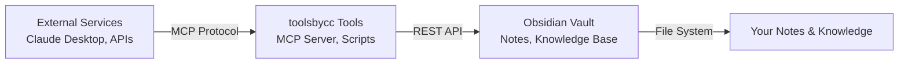

# Tools by Claude Code (toolsbycc)

This directory contains tools and integrations created or managed by Claude Code for the Obsidian vault.

## Directory Structure

```
toolsbycc/
└── obs-mcp-arm64/
    ├── mcp-env/                    # Python virtual environment
    │   ├── bin/
    │   │   ├── mcp-obsidian       # Main MCP server executable
    │   │   └── python3            # Python interpreter
    │   └── lib/                   # Python packages
    ├── .env                       # Environment variables
    ├── claude-mcp-config.json     # Claude Desktop MCP configuration
    ├── mcp-config.json           # Generic MCP configuration
    ├── setup-mcp.sh              # Setup script
    ├── test-mcp.sh               # Test script
    └── MCP-SETUP-GUIDE.md        # Comprehensive setup guide
```

## Tools Overview

### obs-mcp-arm64
**Purpose**: MCP (Model Context Protocol) server for Obsidian integration on ARM64 systems

**What it provides**:
- Claude Desktop can read/write vault notes
- Semantic search across knowledge base
- Template processing and note creation
- Tag and link management

**Key components**:
- Python-based MCP server (ARM64 compatible)
- Obsidian Local REST API integration
- SSL security with proper authentication
- Environment isolation via virtual environment

**Usage**:
```bash
cd /home/averypi/Documents/obs-averivendell/toolsbycc/obs-mcp-arm64
source .env
./mcp-env/bin/mcp-obsidian --help
```

## Architecture

The tools in this directory bridge external services with your Obsidian vault:



## Installation Status

- ✅ **obs-mcp-arm64**: Fully installed and configured
- 🔄 **Future tools**: Space for additional integrations

## Usage Guidelines

1. **Environment Isolation**: Each tool maintains its own environment (Python venv, etc.)
2. **Security**: All tools use proper authentication and secure connections
3. **Documentation**: Each tool includes comprehensive setup guides
4. **Testing**: Test scripts verify functionality before use

## Adding New Tools

When adding new Claude Code tools to this directory:

1. Create a descriptive subdirectory name
2. Include a README or setup guide
3. Maintain environment isolation
4. Follow the established security practices
5. Update this main README

## Maintenance

- **Updates**: Use the provided setup scripts to update tools
- **Testing**: Run test scripts after system changes
- **Backup**: Tools configuration is part of git repository
- **Logs**: Check individual tool directories for logs

---

*Generated by Claude Code for ARM64 Obsidian vault integration*